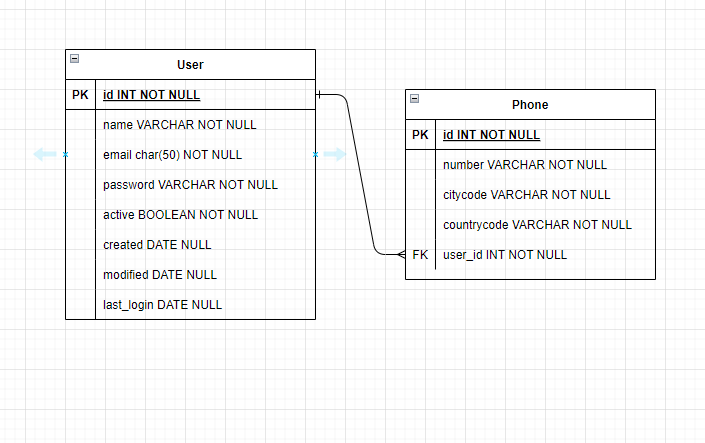
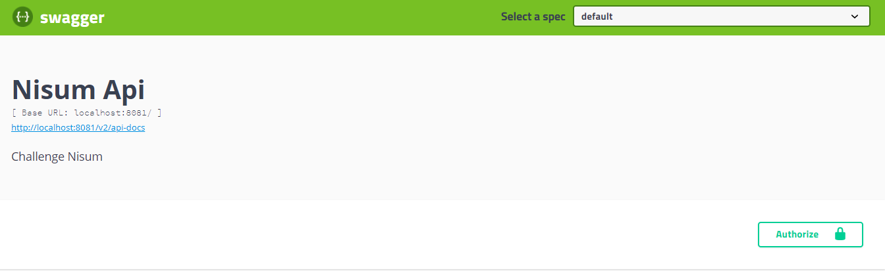

# Nisum API

Prueba tecnica Nisum


### Pre-requisitos 

-Maven <br>
-Lombok

### Base de datos 

Diagrama relacional de la base de datos




### Instalación 

Generar proyecto por maven

```
mvn clean install
```

Ejecutar proyecto por maven

```
mvn spring-boot:run

```
### Uso

Luego de ejecutar el proyecto, podemos visualizar la información de la api a través de la herramienta swagger con el siguiente link de acceso: [http://localhost:8081/swagger-ui.html#/](http://localhost:8081/swagger-ui.html#/ "Swagger UI")


### Autenticación

<bold>Login para usuarios</bold>

```
POST(/auth/login)   
body:  { "email":"{email}", "password":"{password}" }

```

Al momento de loguearse o registrarse se generará un token jwt, el cual debe viajar en cada petición que se haga a los demás servicios.
En swagger debemos colocarlo en la parte superior "Authorize", como se evidencia en la siguiente imagen:



### Usuarios

<bold>Registro para usuarios</bold>

```
POST(/user/registry)   
body:  { "name":"{name}", "email":"{email}", "password":"{password }",
"phones":[{"number":"{number}", "citycode":"{citycode}", "countrycode":"{countrycode}" }]}

```

<bold>Consulta para usuarios</bold>

```
GET(/user/{id})
   
```

<bold>Actualizacion usuarios</bold>

```
PUT(/user/update)   
body:  { "id":"{id}", "name":"{name}", "email":"{email}"}

```

<bold>Eliminacion usuarios</bold>

```
DELETE(/user/{id})   

```
